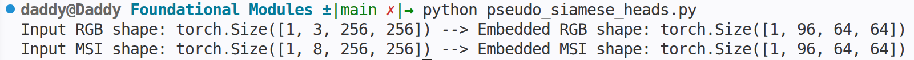

# Foundational Modules

The modules i will be creating are :
1. dataset.py
2. generate_masks.py
3. pseudo_siamese_heads.py
4. 

## dataset.py
- This script will include a custom PyTorch Dataset class specifically for the 2024 MSI dataset that will load the RGB image as 3 channels, the 8 separate MS images and stack them into a single [8, H, W] tensor and will return the paired (RBG, MSI) tensors.

Successfully returns the RGB and MSI tensor pairs !!!

## generate_masks.py
- A baseline physical heuristic that follows simple ***(NIR - Grayscale)***, combined with Otsu thresholding.

|  RGB img  | NIR  img | Subtraced |
| :---: | :---: | :---: |
|  |  |  |

- As seen in the output image, the two dots are extremely noisy and therefore simple pixel differencing fails to capture semantic structure hence we are required to use complex swin transformer architecture
- This necessitates the use of the synthetic augmentation pipeline in Phase 1 for a perfect ground truth prediction and these generated masks can be used in Phase 2 for finetuning the pipeline on noisy masks as ***"Spatial Hints"*** for the model

## pseudo_siamese_heads.py
- This script defines the very first layers of the model (the unshared input heads)
- It will take tensors of depth 3 and 8 as input pass them through the conv2d layers and project them into a shared embedding space

- The above output shows that both modalities are aligned and ready for the Swin transformer blocks.